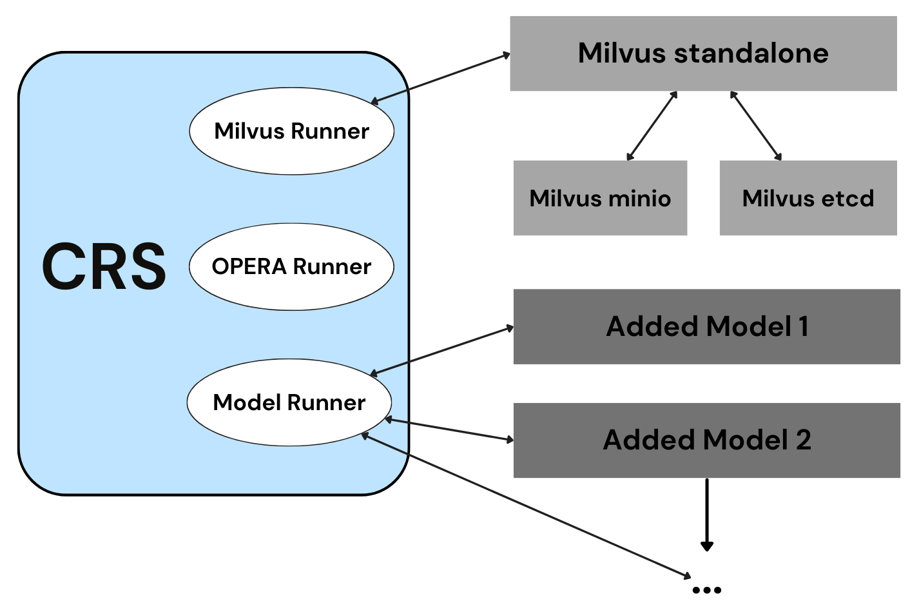
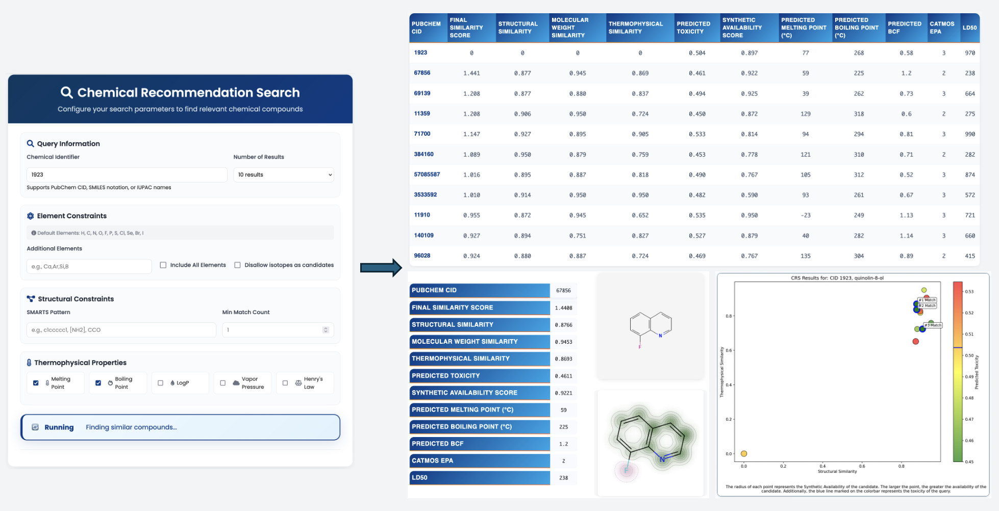

# Summary

The Chemical Recommender System (CRS) is an open-source, high-performance toolkit that enables real-time similarity searches across the complete PubChem database (over 50 million molecules) using commodity hardware. The CRS addresses critical limitations in existing chemical informatics platforms through a novel vector database infrastructure, extensible model integration capabilities, and complete algorithmic transparency. The system implements a vector database deployment with partitioned indexing that achieves a ~60x speedup over traditional approaches. A containerized model integration framework allows researchers to seamlessly incorporate custom predictive models into the full-scale search and scoring pipeline, while complete configurability of search parameters, filtering logic, and scoring functions provides capabilities not available in existing black-box solutions. Beyond structural similarity, the CRS integrates OPERA QSAR models for thermophysical and toxicity predictions, RDKit synthetic accessibility scoring, and user-defined models to compute weighted final replacement scores. The complete system is accessible through an interactive web application supporting real-time progress monitoring, post-processing score re-weighting, automated PDF reporting, and batch processing capabilities.

# Statement of need

Small molecules frequently become 'at risk' or unavailable due to supply, legislative, or technical issues (e.g., the recent discontinuation of PFAS by 3M). In such cases, identifying replacements quickly becomes essential. The CRS has been created to provide a first step in the down-selection of possible replacements for a given target molecule. To use the system, users input a target molecule using SMILES notation or a PubChem identifier through an intuitive web interface, which then performs rapid similarity searches and ranks potential replacements based on multiple criteria.

Chemical recommender systems have been explored in various forms, such as Recommender Systems for Organic Compounds [@Hayashi:2022], which used machine learning techniques for classification, and DeepChem [@Ramsundar:2017], which applies deep learning models to predict solubility and toxicity in drug discovery. However, existing solutions face significant limitations: commercial platforms like PubChem and SigmAldrich provide black-box similarity searches without technical transparency, configurability, or extensibility; academic tools typically operate on limited datasets and lack the infrastructure to handle full-scale chemical databases; and most systems do not offer seamless integration of custom predictive models. The CRS addresses these gaps by providing a completely open-source platform with full configurability of search parameters, filtering logic, and scoring functions. The system's plug-and-play Docker architecture enables researchers to integrate their own models while leveraging the complete PubChem-scale search infrastructure, creating a unique combination of scale, transparency, and extensibility not available in existing solutions.

# Software Overview

## Architecture Overview

{ width=60% }

{ width=101% }

The CRS is architected as a microservices system deployed via Docker Compose, enabling users to initialize the complete infrastructure with a single command.

## Vector Database Infrastructure

The CRS implements a sophisticated vector database infrastructure using Milvus [@Wang:2021] to enable real-time similarity searches across the complete PubChem database (over 50 million molecules) on off-the-shelf machines. The system preprocessing pipeline computes 2048-bit Morgan fingerprints [@CeretoMassague:2015] of radius 2 for all PubChem CIDs using RDKit, creating a comprehensive chemical space representation.

The production deployment utilizes Milvus in standalone mode, supported by dedicated etcd and MinIO containers for metadata management and object storage, respectively. The PubChem dataset is strategically partitioned into 120 indexed segments, with each partition containing approximately 800,000 molecular fingerprints. Precomputed inverted files for indexing with 1024 cluster centroids computed via k-means clustering of centroids in the JACCARD distance space are prebuilt into the CRS image, and is the key to allowing faster similarity searches. Moreover, the partitioning strategy enables parallel processing and memory optimization while maintaining search performance, using a pseudo sliding window of the data in RAM.

The CRS allows for the number of partitions searched per batch to be configurable via environment variables, allowing fine-tuning for different hardware configurations. The system uses the JACCARD metric for Tanimoto similarity computation \hyperref[eq:tani]{Equation 1}, with optimized search parameters including configurable probe values for index traversal efficiency.

\begin{equation}\label{eq:tani}
Tani(F_i,F_j)=\frac{F_i\cdot F_j}{\sum\limits_{k}F_{i_k}+\sum\limits_{k}F_{j_k} - F_i\cdot F_j}
\end{equation}

The search algorithm employs a two-stage approximate nearest neighbor approach. First, it identifies the closest cluster centroids to the query vector in JACCARD space. Then, it performs exhaustive similarity calculations within those selected clusters, reducing computational complexity from $O(N)$ to $O(\text{nprobe} \times \frac{N}{\text{nlist}} + \text{nlist})$ for large-scale searches. An LRU cache stores recent search results keyed by fingerprint hash and result count to minimize redundant database queries. Our experiments demonstrate that this infrastructure enables searches over the whole dataset that complete in minutes rather than hours on standard hardware.

## Extensible Model Integration

The CRS implements a containerized model integration framework using Docker Compose, enabling any SMILES-to-numeric model to plug into the search pipeline with minimal setup. Researchers wrap their model in a Docker container exposing a Flask API, add it to the Compose file with networking and resource constraints, and supply its name to the CRS via CLI. At runtime, the CRS invokes models over HTTP for each candidate, and integrates the predictions—weighted by user-configurable parameters—into the overall ranking.

Despite the proliferation of bespoke predictive models in cheminformatics, there remains no simple standardized environment for rigorous testing and benchmarking within full-scale search workflows. Many researchers must invest significant effort to validate container deployments, configure execution pipelines, and harmonize output metrics, hindering reproducibility and comparability. The CRS addresses this gap by providing a transparent framework that unifies model deployment, invocation, and performance evaluation against a live PubChem similarity search pipeline, enabling domain experts to concentrate on model development rather than infrastructure.

## Open Architecture and Configurability

Unlike many current black-box commercial solutions, the CRS provides complete transparency and control over search parameters, filtering criteria, and scoring algorithms, significantly benefiting researchers. The open-source nature of the CRS allows researchers to modify the source code, customize scoring algorithms, and implement domain-specific filters, ensuring that the system can be tailored to meet specific application needs. The modular architecture allows for targeted modifications without affecting other components, while comprehensive logging and monitoring capabilities enhance usability, empowering researchers with the flexibility and control that black-box solutions lack.

## Multi-Property Scoring and Integration

The CRS computes final replacement scores by integrating multiple property-based similarity metrics through a sophisticated comparison pipeline. The system uses OPERA [@Mansouri:2018] QSAR models to predict five categories of thermophysical properties (melting point, boiling point, logP, vapor pressure, Henry's law constant), structural descriptors (molecular weight, ring count, Lipinski failures, carbon count, topological polar surface area), and toxicity endpoints (BCF, CATMoS EPA categories, LD50). Additionally, RDKit synthetic accessibility scoring [@Skoraczynski:2023] (ranging from 1=easy to 10=difficult) estimates synthesis complexity using fragment contribution models trained on PubChem fingerprints. The CRS normalizes these scores to a 1-10 scale where higher values indicate easier synthesis by applying the transformation: $SA_{final} = 10 - SA_{raw}$.

The scoring algorithm computes similarity metrics by comparing candidate properties against query molecule properties using normalized difference calculations. Each property category contributes a similarity score (C$_1$ through C$_5$ for structural, molecular weight, thermophysical, toxicity, and synthetic accessibility respectively), with additional categories (C$_{5+n}$) generated by user-provided models. The final replacement score is computed using a weighted multiplicative model:

\begin{equation}\label{eq:final_score}
\text{FRS} = \frac{C_1^{W_1} \times C_2^{W_2} \times C_3^{W_3} \times C_5^{W_5} \times \prod_{i=6}^{n} C_i^{W_i}}{C_4^{W_4}}
\end{equation}

where C$_1$ represents structural (Tanimoto) similarity, C$_2$ molecular weight similarity, C$_3$ thermophysical similarity, C$_4$ toxicity score (inversely weighted), C$_5$ synthetic accessibility, and C$_{5+n}$ represent external model contributions. The weights W$_i$ are user-configurable parameters that enable domain-specific prioritization of different molecular properties. 

Prior to final score computation, all similarity metrics undergo Min-Max normalization to ensure comparable scales across different property types: This transformation maps all scores to a 1-10 range while preserving relative differences between candidates. The system supports real-time re-weighting through the web interface, enabling interactive exploration of results with different prioritization schemes without requiring database re-queries.

## Advanced Workflow Capabilities

The CRS implements comprehensive batch processing functionality that enables high-throughput chemical analysis workflows. The system provides sophisticated filtering capabilities including configurable elemental restrictions beyond the default set (H, C, N, O, F, P, S, Cl, Se, Br, I), SMARTS-based substructure matching with occurrence count requirements, and isotope handling options. Advanced search parameters support both PubChem CIDs, IUPAC names, and arbitrary SMILES strings, including hypothetical molecules not present in existing databases.

The CRS implements intelligent progress monitoring with real-time status updates via Server-Sent Events, enabling users to track job progress, identify processing bottlenecks, and receive immediate feedback on search completion or error conditions. The system generates comprehensive PDF reports automatically for each query, combining molecular visualizations, property predictions, similarity scores, and ranking justifications into publication-ready documentation. Batch jobs produce consolidated reports with cross-query analysis and statistical summaries.

{ width=100% }

# Code Availability
The CRS source code is available for free on Github under the BSD-3-Clause license ([https://github.com/sandialabs/chemical-recommender-system](https://github.com/sandialabs/chemical-recommender-system)), and can be used to install and run the CRS.

# Acknowledgments
Sandia National Laboratories is a multi-mission laboratory managed and oper-
ated by National Technology & Engineering Solutions of Sandia, LLC (NTESS),
a wholly owned subsidiary of Honeywell International Inc., for the U.S. Department of Energy’s National Nuclear Security Administration (DOE/NNSA) under contract DE-NA0003525. This written work is authored by an employee of
NTESS. The employee, not NTESS, owns the right, title and interest in and to
the written work and is responsible for its contents. Any subjective views or opinions that might be expressed in the written work do not necessarily represent the views of the U.S. Government. The publisher acknowledges that the U.S. Government retains a non-exclusive, paid-up, irrevocable, world-wide license to publish or reproduce the published form of this written work or allow others to do so, for U.S. Government purposes. The DOE will provide public access to results of federally sponsored research in accordance with the DOE Public Access Plan.

# References
